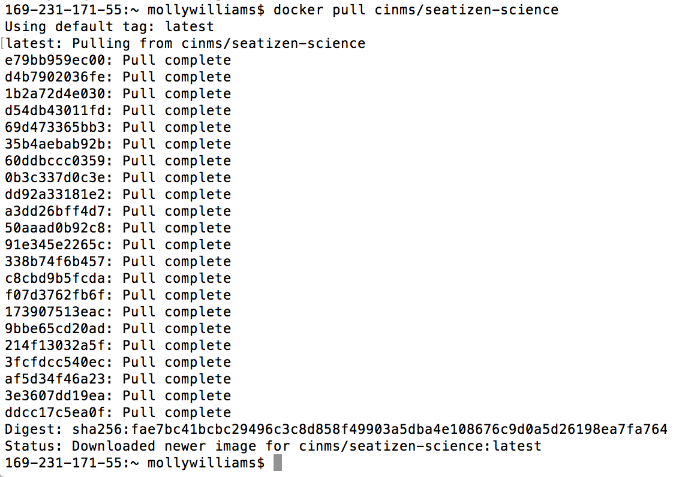
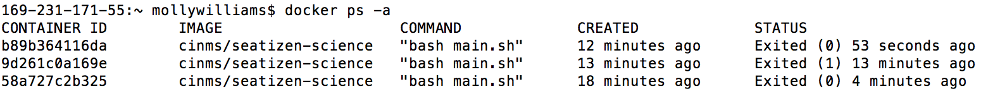
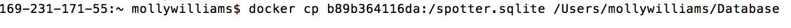

# Accessing the Database with Docker {#docker}

Some info about Docker 

*Note: Ensure all required software is installed before starting Docker instructions (see 1.1: Required Software)*

## Instructions for Mac/Linux users 
The only text you need to copy and paste into the terminal is offset in a different font below.

**1. Open command terminal**
    - Shortcut: Command+space, type "terminal"

 
**2. Login to Docker account in the terminal**

$     `docker login --username=your_username`

 
**3. Pull docker image:**

$     `docker pull cinms/seatizen-science`

 
**4. Run image:**

$     `docker run –it cinms/seatizen-science`

 
**5. View container IDs and copy the most recently created one:** 

$     `docker ps -a`

 
**6. Use “docker cp” to copy the database to a local folder:**

$     `docker cp containerID:/spotter.sqlite/file/path/here`  

Nice job! Jump to Chapter 3 to learn how to navigate the database using SQLite Studio.

---

## Instructions for Windows users

**1. [Download Docker Toolbox](https://download.docker.com/win/stable/DockerToolbox.exe )**
Click the DockerToolbox.exe file and follow the instructions in the “Welcome to Docker Toolbox Setup Wizard.” Once the download is complete, open Docker Quickstart Terminal.

**2. Login to Docker**
In the terminal, type "docker login". Once you hit enter, Docker Quickstart Terminal will prompt you to enter your username and password. You can either use the previously setup account (Username=cinms, Password=cinmswhales) or your own account. When you are successfully logged in, Docker Quickstart Terminal will say “Login Succeeded”.

 
**3. Pull docker image:**

$     `docker pull cinms/seatizen-science`

 
**4. Run image:**

$     `docker run –it cinms/seatizen-science`

 
**5. View container IDs and copy the most recently created one:** 

$     `docker ps -a`

 
**6. Use “docker cp” to copy the database to a local folder:**

$     `docker cp containerID:spotter.sqlite “c:\file\path”`  

 
**7. Mount Docker to a local database using the Docker Quickstart Terminal:**

$    `docker run –it –v c:/Local/Path/For/DatabaseFolder/spotter.sqlite cinms/seatizen-science`

*For example: docker run –it -v c:/Users/ckorm/spotter.sqlite cinms/seatizen-science*

-----

## Instructions for Kitematic 
(for Windows users, as an alternative to Docker Toolbox)

1. Setup Docker on your computer by installing docker toolbox: https://docs.docker.com/toolbox/toolbox_install_windows/ 

2. Open Docker Quickstart Terminal 

3. Search for “seatizen-science”:
	-Click “create”

3. Run the “seatizen-science”:
	-If it isn’t running already, click “Run”

4. Click DOCKER CLI or Use Docker Quickstart Terminal: 
	-Should open command prompt/terminal 

5. See all container ID’s:

	$docker ps -a

6. Copy the container ID that was just created and use: “docker cp” to copy the database to a local folder:
 
 
Mac or Linux:
docker cp  container ID:/spotter.sqlite  /Users/folder /spotter.sqlite
Windows:
docker cp containerID:spotter.sqlite “c:\Document\spotter.sqlite”
Finally, to update your newly acquired database in the future, mount the seatizen_science_app to the local database. 

-	Type “docker run” space “-v” then the path to your local spotter.sqlite database, then type “:/spotter.sqlite” followed by a space, and type “seangoral/seatizen_science_app” and press ENTER.

EX:

docker run -v /Local/Path/For/DatabaseFolder/spotter.sqlite:/spotter.sqlite seangoral/seatizen_science_app

----

## Docker Syntax 
[Read more on specifics on docker syntax and commands here.](https://docs.docker.com/engine/reference/builder/ )

**Management Commands:**

Command | Action
--------|----------
config     | Manage Docker configs
container | Manage containers
image     |  Manage images 
network   |  Manage networks
node      |  Manage Swarm nodes
plugin    |  Manage plugins
secret    |  Manage Docker secrets
service   |  Manage services
swarm     |  Manage Swarm
system    |  Manage Docker
trust     |  Manage trust on Docker images
volume    |  Manage volumes

**Commands:**

Command | Action
--------|--------
attach  | Attach local standard input, output, and error streams to a running container
build     | Build an image from a Dockerfile
commit    | Create a new image from a container's changes
cp        | Copy files/folders between a container and the local filesystem
create    | Create a new container
diff      | Inspect changes to files or directories on a container's filesystem
events    | Get real time events from the server
exec      | Run a command in a running container
export    | Export a container's filesystem as a tar archive
history   |  Show the history of an image
images    | List images
import    | Import the contents from a tarball to create a filesystem image
info      | Display system-wide information
inspect   | Return low-level information on Docker objects
kill      | Kill one or more running containers
load      | Load an image from a tar archive or STDIN
login     | Log in to a Docker registry
logout    | Log out from a Docker registry
logs      | Fetch the logs of a container
pause     | Pause all processes within one or more containers
port      | List port mappings or a specific mapping for the container
ps        | List containers
pull      | Pull an image or a repository from a registry
push      | Push an image or a repository to a registry
rename    | Rename a container
restart   | Restart one or more containers
rm        | Remove one or more containers
rmi       | Remove one or more images
run       | Run a command in a new container
save      | Save one or more images to a tar archive (streamed to STDOUT by default)
search    | Search the Docker Hub for images
start     | Start one or more stopped containers
stats     | Display a live stream of container(s) resource usage statistics
stop      | Stop one or more running containers
tag       | Create a tag TARGET_IMAGE that refers to SOURCE_IMAGE
top       | Display the running processes of a container
unpause   | Unpause all processes within one or more containers
update    | Update configuration of one or more containers
version   | Show the Docker version information
wait      | Block until one or more containers stop, then print their exit codes

